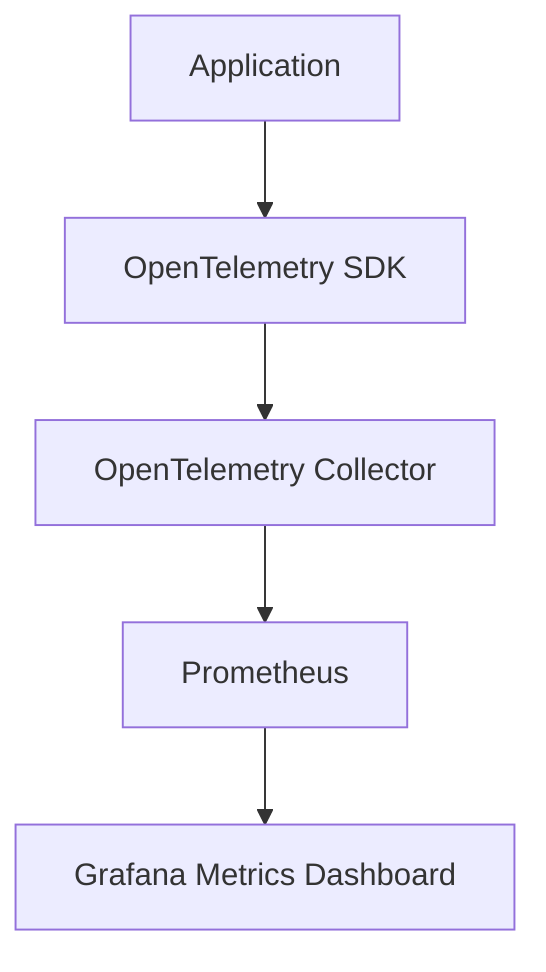
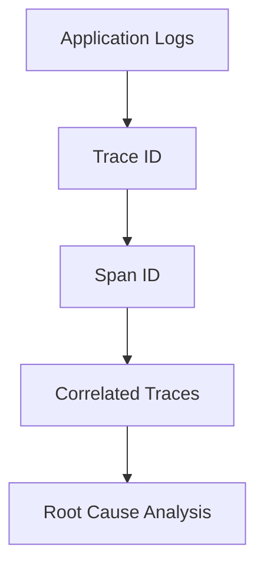
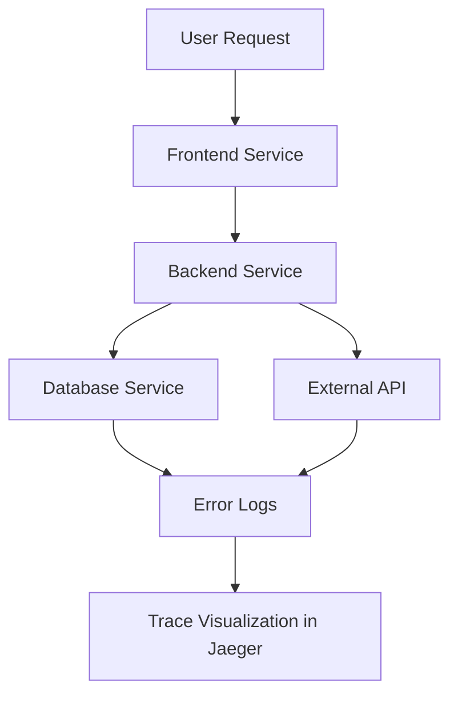
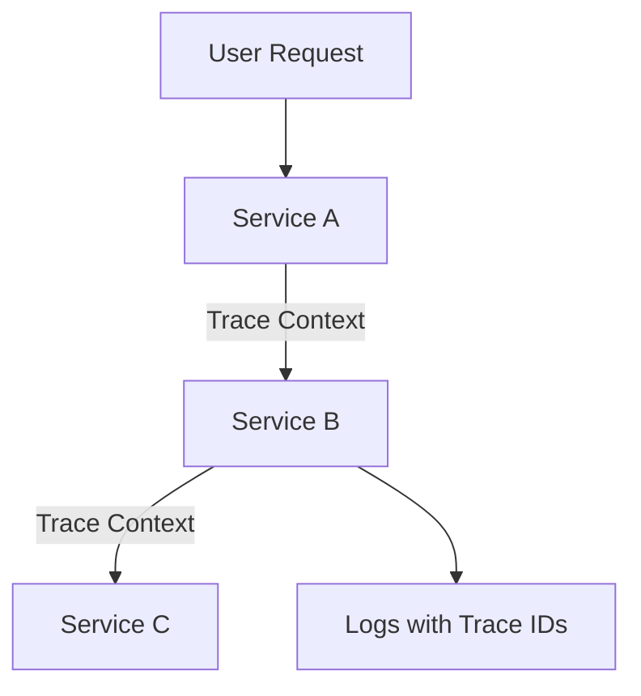
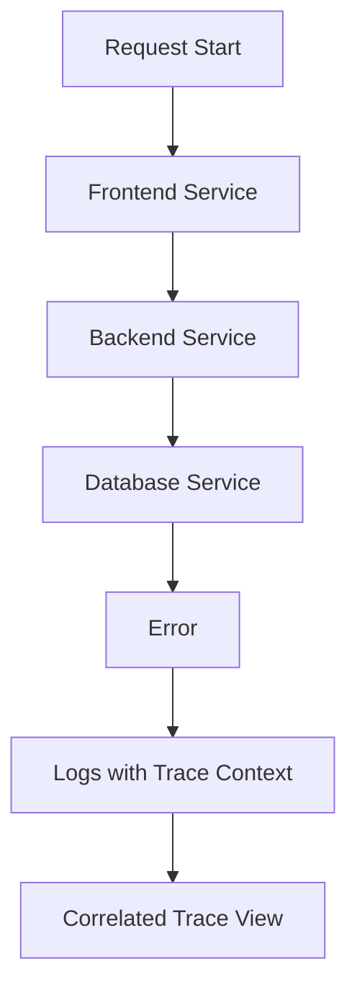
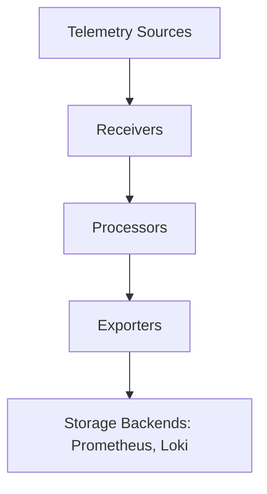

## Overview

Observability enables understanding of the internal state of a system based on the data it generates. The three pillars of observability are **Metrics**, **Logs**, and **Traces**, each serving a distinct purpose but working cohesively to enhance system visibility.

---

## Observability Pillars

### Metrics

> [!info] **Metrics Overview** Metrics are **quantitative data** about system performance, such as CPU usage, memory consumption, and request rates.

- **Tools**: Prometheus, OpenTelemetry.
- **Pipeline**:
    1. Application generates metrics using OpenTelemetry SDK.
    2. Metrics are processed by OpenTelemetry Collector.
    3. Stored in Prometheus and visualized in Grafana.

> [!tip] Metrics Use Case  
> Use metrics to detect system anomalies like spikes in CPU usage or sudden drops in throughput.

---

### Logs

> [!info] **Logs Overview** Logs are **qualitative data** that record events, errors, and debugging information within the system.

- **Tools**: Loki, Fluentd.
- **Tracing in Logs**:
    - Logs carry **trace IDs** and **span IDs** for correlation with distributed traces.
    - This enables linking log messages to specific operations.

> [!note] Example Log with Trace Context  
> Including trace IDs in logs ensures that you can cross-reference logs with distributed traces.

---

### Traces

> [!info] **Traces Overview** Traces capture the **path** of a request through different system components, providing insights into performance bottlenecks.

- **Tools**: Jaeger, Tempo, OpenTelemetry.
- **Key Features**:
    - Each request is assigned a **trace ID**.
    - Sub-operations within the request have unique **span IDs**.

#### How Traces Work:

> [!tip] Tracing Use Case  
> Use traces to identify slow database queries or failed API calls.

---

## Context Propagation

> [!abstract] **What is Context Propagation?**  
> Context propagation ensures trace IDs and metadata (e.g., user ID, tenant ID) are carried across service boundaries. This enables correlation of signals across distributed systems.

### Components:

1. **Trace ID**: Unique identifier for a trace.
2. **Span ID**: Identifies a single operation within a trace.
3. **Baggage**: Key-value pairs carrying metadata, such as tenant or user IDs.

#### Propagation Flow:

> [!example] Real-World Scenario  
> A trace ID links log messages and spans, making it easy to identify the root cause of an issue across services.

---

## Debugging with Observability

### Example: A Request Fails

1. **Logs**: Contain error messages, such as "Database connection failed."
2. **Metrics**: Show high latency or CPU usage.
3. **Traces**: Pinpoint the specific failing operation.

> [!important] Debugging Steps

1. Search logs for errors with the **trace ID**.
2. Analyze traces for slow or failing spans.
3. Correlate metrics to determine if resource constraints caused the failure.

---

## OpenTelemetry Collector

> [!abstract] **OpenTelemetry Collector Architecture**  
> The OpenTelemetry Collector acts as a proxy for telemetry data, receiving, processing, and exporting it to various systems.

### Components:

1. **Receivers**: Ingest telemetry from sources (e.g., Prometheus, Jaeger).
2. **Processors**: Apply transformations like batching or sampling.
3. **Exporters**: Forward data to storage backends (e.g., Loki, Jaeger).

> [!info] Processor Types
> 
> - **Batch Processor**: Groups data for efficient processing.
> - **Sampling Processor**: Filters traces based on criteria.
> - **Filtering Processor**: Selectively processes specific data types.

---

> [!important] **Best Practices**

1. Always enrich logs with trace IDs and span IDs.
2. Use structured logging formats (e.g., JSON) for easier querying.
3. Integrate all signals (metrics, logs, traces) into systems like Grafana or Elastic.