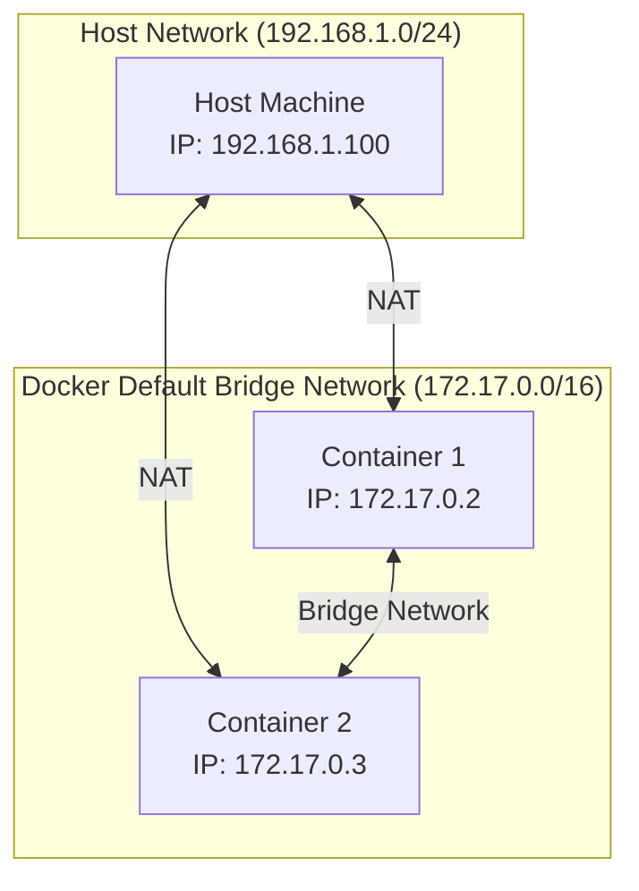
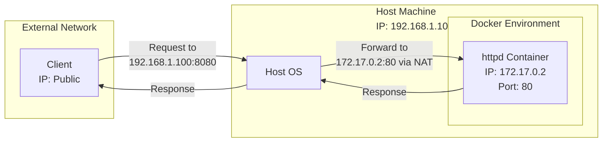

- Each container connected to a private virtual network `bridge`
- Each virtual network routes through NAT firewall on host IP
- All containers on a virtual network can talk to each other without `-p`

- We also have support to multiple network [drivers ](https://docs.docker.com/engine/network/drivers)
	- bridge

### We can make container
- to point to no network
- to point to multiple networks
- to skip & use host IP `--net=host`

### Default network behavior

### Port routing with host

### Via CLI Management
- show networks: `docker network ls`
- inspect a network: `docker newtwork inspect`
- create a network: `docker network create --driver`
- attach a network to container: `docker network connect`
 - detach a network from container: `docker network disconect`

### DNS
- docker uses container names as to id to talk with each other, automatic DNS resolution with container names
- routing based on round robin, here spinned up two `elasticsearch` servers, each access on round robin fashon via curl on same docker network
![[Pasted image 20241113120639.png]]

