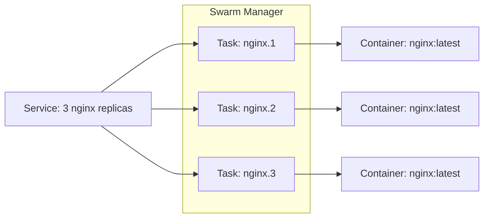
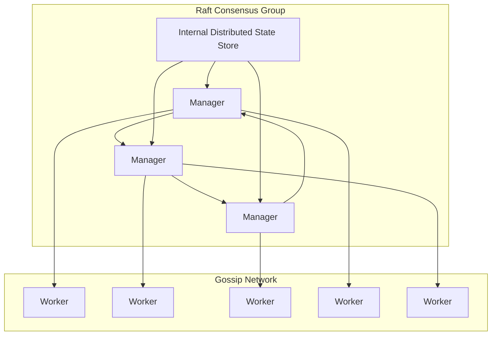

- To automate container lifecycle
- brings different host machine into a single managable unit

- not enabled by default

---

## Docker Swarm Upgrade Process

### Diagram 1: Nginx Service with Replicas

swarm replaces `docker run`,  `service` -> `replicas`

---

### Diagram 2: Swarm Architecture
![[Pasted image 20241119143851.png]]

---

- raft database, 
- manager - worker
- has CA & secure communiation across nodes
- default disk encryption for raft database