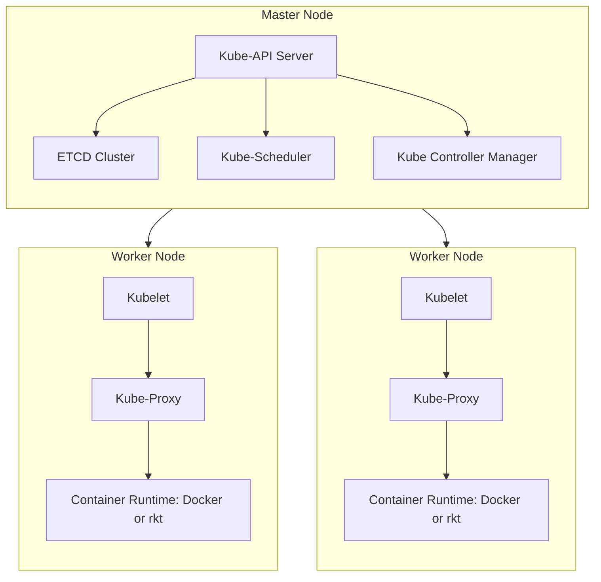
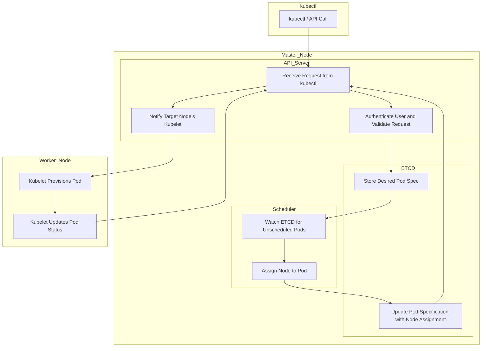

#DevOps 
#Docker 
## Core Concepts

### 1. **Cluster Architecture**

- Kubernetes follows a **Master-Worker architecture**.
- The **Master Node** manages the cluster by scheduling, monitoring, and orchestrating containers.
- The **Worker Nodes** host and run application containers.

---

### 2. **Master Node Components**

#### **ETCD Cluster**

- Acts as the key-value store for Kubernetes.
- Stores cluster data such as configurations, secrets, and states.

> [!note] Critical Component  
> ETCD is the backbone of Kubernetes, storing the state of the entire cluster. If ETCD fails, the cluster's state may be lost.

#### **Kube-API Server**

- The main entry point for all administrative tasks.
- Exposes Kubernetes APIs and manages communication between other master components and worker nodes.

> [!important] Containerized Component  
> The **kube-apiserver** can be deployed as a container on the master node.

#### **Kube-Scheduler**

- Responsible for placing containers on worker nodes based on scheduling policies (e.g., resource requirements).

#### **Controller Manager**

- Manages control loops to ensure the desired state is maintained.
    - **Node Controller:** Handles node lifecycle events, such as onboarding new nodes.
    - **Replication Controller:** Ensures the correct number of pod replicas are running.
- request scheduler to create a container if the container failes

---

### 3. **Worker Node Components**

#### **Container Runtime Engine**

- Runs containers using a runtime such as:
    - **Docker**
    - **Rocket (rkt)**

#### **Kubelet**

- An agent that runs on each worker node.
- Listens to the API server and executes instructions such as starting/stopping containers.
- Sends periodic status reports back to the API server.

> [!example] Kubelet Reports  
> Kubelet periodically reports the node's health and running container statuses to the kube-apiserver.

#### **Kube-Proxy**

- Maintains network rules and facilitates communication between pods and services across nodes.

> [!note] Networking Role  
> The **kube-proxy** is key for enabling seamless pod-to-pod communication within the cluster.

---

## Kubernetes Network

- The **Kube-Proxy** ensures connectivity between worker nodes, enabling them to communicate and work collaboratively.

---

## Deployment of Master and Worker Components

> [!info] Containerized Components
> 
> - On the **Master Node**, the following can run as containers:
>     - **kube-apiserver**
>     - **kube-scheduler**
>     - **controller manager**
> - On the **Worker Nodes**, the following can be containerized:
>     - **kubelet**
>     - **kube-proxy**

---
## **Mermaid Diagram**

### Simple flow of pod creation via kubectl

### Descriptions:

1. **kubectl / API Call**: A request to create a pod is sent by the user or system.
2. **API Server**: The API server handles the request and authenticates/validates it.
3. **ETCD**: Stores the desired state of the pod.
4. **Scheduler**: Monitors ETCD for pods without node assignments, schedules them to a suitable node, and updates the ETCD.
5. **Kubelet**: On the selected node, provisions the pod, and updates its status back to ETCD through the API Server.

---
### Components
- [[services]]
- [[K8s Controllers]]
- [[Pods]]
- [[Scheduling]]
- [[k8s namespaces]]
