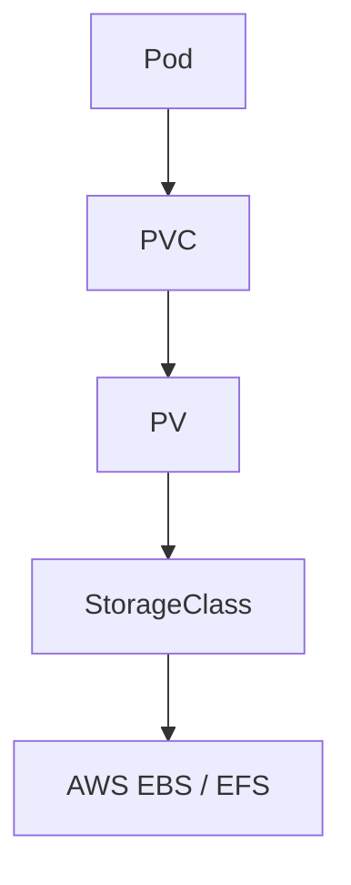

# **Kubernetes Storage and Volumes**

## **Introduction**

> [!abstract]  
> Kubernetes provides flexible storage management to support both ephemeral and persistent data needs, catering to stateful and stateless applications.

Kubernetes integrates well with cloud storage systems like AWS EBS and EFS, providing abstractions like **Persistent Volumes (PV)**, **Persistent Volume Claims (PVC)**, and **StorageClasses**.

---

## **Key Concepts**

### **1. Volumes**

> [!info]  
> Kubernetes volumes attach storage to pods. Volumes solve the ephemeral nature of container storage, persisting data across container restarts.

#### **Types of Volumes**

1. **EmptyDir**

  > [!note]  
   > An **EmptyDir** volume is created when a pod is assigned to a node and exists as long as the pod runs. Data is deleted when the pod is removed.

  **Use Case**: Temporary storage like caching or scratch space.
  
   ```yaml
   volumes:
   - name: cache-volume
     emptyDir: {}
   ```
  
2. **HostPath**
   
   > [!warning]  
   > Using **HostPath** can cause portability issues since it binds pods to specific nodes.
   
   **Use Case**: Accessing host system files.
   
   ```yaml
   hostPath:
     path: /data
     type: Directory
  ```
    
3. **Persistent Volume (PV)** and **Persistent Volume Claim (PVC)**
   
   > [!summary]  
   > These manage persistent storage for Kubernetes workloads. PV provides the storage, while PVC is the pod's request for it.
   
4. **Cloud-Specific Volumes**  
   Example: AWS EBS for single-node block storage or AWS EFS for multi-node file storage.
   

---

### **2. Persistent Volumes (PV)**

> [!info]  
> A **Persistent Volume** (PV) is a storage resource in the Kubernetes cluster, provisioned either dynamically or statically.

#### **Key Attributes**

- **Capacity**: Defines the storage size.
- **Access Modes**:
    - `ReadWriteOnce (RWO)` – Single node read/write.
    - `ReadOnlyMany (ROX)` – Multiple nodes read-only.
    - `ReadWriteMany (RWX)` – Multiple nodes read/write.
- **Reclaim Policy**:
    - `Retain`: Keeps the volume for manual cleanup.
    - `Delete`: Deletes the volume with the PVC.
    - `Recycle`: Clears the volume (deprecated).

#### **Example: Static PV**

> [!example]  
> Static provisioning requires pre-creating the PV.

```yaml
apiVersion: v1
kind: PersistentVolume
metadata:
  name: static-pv
spec:
  capacity:
    storage: 10Gi
  accessModes:
    - ReadWriteOnce
  persistentVolumeReclaimPolicy: Retain
  awsElasticBlockStore:
    volumeID: vol-0abcdef1234567890
    fsType: ext4
```

---

### **3. Persistent Volume Claims (PVC)**

> [!quote]  
> _"A PVC acts as a bridge between the application and the underlying storage."_

#### **PVC Example**

```yaml
apiVersion: v1
kind: PersistentVolumeClaim
metadata:
  name: example-pvc
spec:
  accessModes:
    - ReadWriteOnce
  resources:
    requests:
      storage: 10Gi
  storageClassName: gp2
```

#### **Binding PV to PVC**

- PVCs are automatically bound to PVs with matching criteria.
- If no suitable PV exists, dynamic provisioning creates a PV using a specified **StorageClass**.

---

### **4. StorageClasses**

> [!tip]  
> A **StorageClass** provides templates for dynamic provisioning of Persistent Volumes.

#### **Key Features**

1. **Provisioner**: Defines the backend storage type (e.g., AWS EBS or EFS).
2. **Parameters**: Configures storage properties like volume type and file system.
3. **Reclaim Policy**: Determines volume behavior post-PVC deletion.
4. **Binding Mode**:
    - `Immediate`: PV is created immediately.
    - `WaitForFirstConsumer`: Delays PV creation until a pod schedules.

#### **Example: EBS StorageClass**

```yaml
apiVersion: storage.k8s.io/v1
kind: StorageClass
metadata:
  name: ebs-sc
provisioner: kubernetes.io/aws-ebs
parameters:
  type: gp2
  fsType: ext4
reclaimPolicy: Delete
volumeBindingMode: WaitForFirstConsumer
```

---

### **AWS-Specific Storage**

#### **1. AWS EBS (Elastic Block Store)**

> [!note]  
> EBS is ideal for single-node applications requiring low-latency storage.

- **Type**: Block storage.
- **Access Modes**: `ReadWriteOnce (RWO)` – Single node.
- **Use Cases**: Databases (MySQL, PostgreSQL), application data.

> [!caution]  
> EBS is tied to a single Availability Zone and cannot be shared across multiple nodes.

#### **Example: EBS StorageClass**

```yaml
apiVersion: storage.k8s.io/v1
kind: StorageClass
metadata:
  name: ebs-storageclass
provisioner: kubernetes.io/aws-ebs
parameters:
  type: gp2
  fsType: ext4
  zones: us-west-1a
```

---

#### **2. AWS EFS (Elastic File System)**

> [!info]  
> EFS is a scalable file storage service that allows multiple nodes to access the same data.

- **Type**: File storage.
- **Access Modes**: `ReadWriteMany (RWX)` – Shared access.
- **Use Cases**: Web servers, shared logs, and persistent files.

> [!success]  
> EFS supports multi-AZ replication, providing high availability and fault tolerance.

#### **Example: EFS StorageClass**

```yaml
apiVersion: storage.k8s.io/v1
kind: StorageClass
metadata:
  name: efs-storageclass
provisioner: efs.csi.aws.com
parameters:
  provisioningMode: efs-ap
  fileSystemId: fs-0987654321
```

---

## **Dynamic vs. Static Provisioning**

|Feature|Static Provisioning|Dynamic Provisioning|
|---|---|---|
|**Definition**|Admin creates PV manually.|PVC triggers automatic PV creation.|
|**Flexibility**|Requires admin intervention.|Fully automated.|
|**Use Case**|Legacy or custom storage systems.|Modern cloud-native environments.|

---

## **Visual Representation**



---

## **Common Queries**

> [!question]

- What’s the difference between EBS and EFS in Kubernetes?
    - **EBS**: Block storage for single-node use (RWO).
    - **EFS**: File storage for multi-node shared use (RWX).

### **Relevants**

```query
tag:#kubernetes
```

---

## **References**

> [!quote]  
> "Persistent storage is the backbone of stateful applications in Kubernetes."

- Kubernetes Documentation: [Persistent Volumes](https://kubernetes.io/docs/concepts/storage/persistent-volumes/)
- AWS EKS Guide: [EBS and EFS](https://docs.aws.amazon.com/eks/latest/userguide/)
