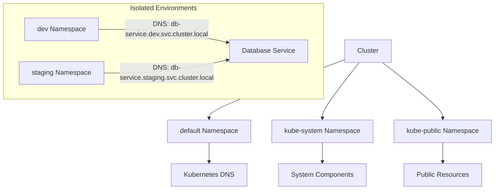

# Kubernetes Namespaces

## Overview

Namespaces in Kubernetes are a way to isolate and organize resources within a cluster.

### Key Namespaces

1. **default**:
    
    - Created by default in all clusters.
    - Contains Kubernetes DNS and other critical components.
    - **Risk**: Users may accidentally delete critical resources.
2. **kube-system**:
    
    - Contains system-level components like the Kubernetes API server, scheduler, and other critical services.
    - Isolates system resources from user-created namespaces.
3. **kube-public**:
    
    - Used for resources that should be publicly accessible within the cluster.
    - Example: Public ConfigMaps for cluster information.

---

## Namespaces and Resource Limits

> [!note] Namespace Usage
> 
> - It is common to create separate namespaces for different environments:
>     - `dev`, `staging`, `production`, etc.
> - Resource limits can be applied to namespaces for controlled resource usage.

### DNS in Namespaces

- **Within the same namespace**:  
    Example:
    
    ```bash
    mysql.connect("db-service")
    ```
    
- **Across different namespaces**:  
    Example:
    
    ```bash
    mysql.connect("db-service.dev.svc.cluster.local")
    ```
    
    - Format: `service-name.<namespace-name>.<svc>.<cluster-domain>`

---

## Creating Namespaces

Namespaces can be created using:

1. **Command**:
    
    ```bash
    kubectl create namespace <namespace-name>
    ```
    
2. **Definition file**:
    
    ```yaml
    apiVersion: v1
    kind: Namespace
    metadata:
      name: <namespace-name>
    ```
    

---

## Resource Limits

To limit resources in a namespace, a **ResourceQuota** definition file is used. Example:

```yaml
apiVersion: v1
kind: ResourceQuota
metadata:
  name: resource-limits
  namespace: <namespace-name>
spec:
  hard:
    requests.cpu: "1"
    requests.memory: "1Gi"
    limits.cpu: "2"
    limits.memory: "2Gi"
```

> Ensure resource quotas are precise to avoid resource contention.

---

## Mermaid Diagram



---

## Summary

Namespaces in Kubernetes provide:

- Resource isolation.
- Organizational structure for environments.
- Resource quotas to enforce limits.
- Built-in namespaces (`default`, `kube-system`, `kube-public`) for specific purposes.