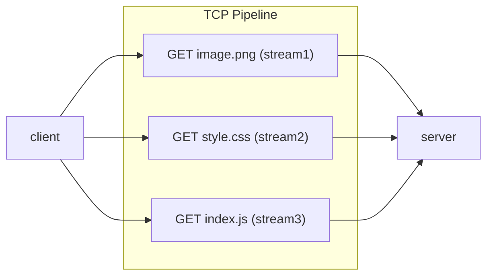
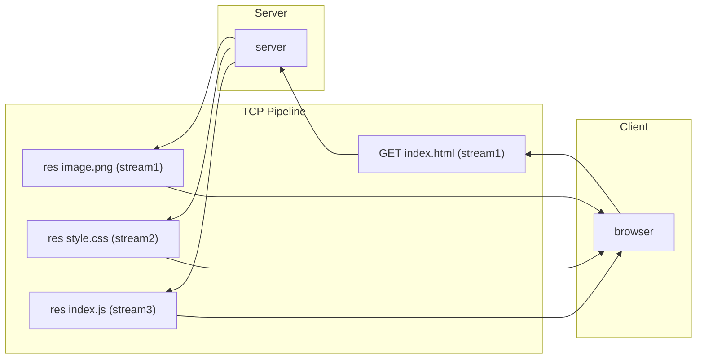

#protocol 
#TCP 

To overcome the Pipelining issue in [[HTTP 1.1]] i uses a special system called ==streams== and ==push==
- Where each request is bind in the form of streams (assigned with a stream id).
- so multiple streams can be passed in a single [[TCP]] connection.

- All request is identified with the **stream_id**.
- Also with push with single request we can configure the server to response with multiple responses.

- The default port is changed to ==443 ( with TLS )== instead of 80

Cons:
- Even though I have some advantage, since we are using additional streams. There is a additional ==parsing== process in the protocol level (i.e each stream has to be parsed now)