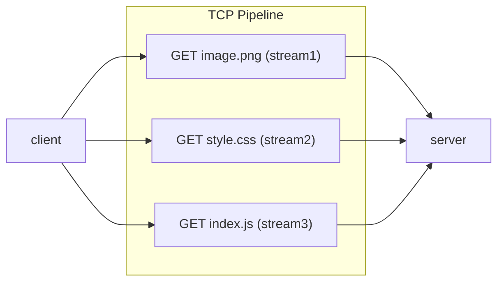

ning the code snippets throughout this guide in an #protocol 
#TCP 

To overcome the Pipelining issue in [[HTTP 1.1]] i uses a special system called ==streams== ( provides **multiplexing capability** )and ==push==
- Where each request is bind in the form of streams (assigned with a stream id).
- so multiple streams can be passed in a single [[TCP]] connection.

- All request is identified with the **stream_id**.
- Also with push with single request we can configure the server to response with multiple responses.
```mermaid
graph RL
	id1[browser]
	id2[server]
	r1["GET index.html (stream1)"]
	R1["res image.png (stream1)"]
	R2["res style.css (stream2)"]
	R3["res index.js (stream3)"]
	subgraph "Client"
	id1
	end
	id1 --> r1
	R1 --> id1
	R2 --> id1
	R3 --> id1
	 
	subgraph "TCP Pipeline"
	r1
	R1
	R2
	R3
	end
	subgraph "Server"
	id2
	end
	r1 --> id2
	id2 --> R1
	id2 --> R2
	id2 --> R3
 ```
 ```mermaid
 sequenceDiagram
	 Client->>Server: GET index.html (stream1)
	 Note over Client,Server: Multiple response by push
	 Server->>Client: res index.html (stream2)
	 Server->>Client: res image.png (stream3)
	 Server->>Client: res style.css (stream4)
	 Server->>Client: res index.js (stream15
	 
```
- The default port is changed to ==443 ( with TLS )== instead of 80
- No the headers also getting compressed


Cons:
- Even though I have some advantage, since we are using additional streams. There is a additional ==parsing== process in the protocol level (i.e each stream has to be parsed now)


## Test sample using express
- requires [[mkcert]] to emulate the TLS for localhost 
```js
const express = require("express");
const http2 = require("http2");
const http2Express = require("http2-express-bridge");
const { readFileSync } = require("fs");

const app = http2Express(express);

app.get("/express", (req, res) => {
res.send("hello World");
});

const options = {
key: readFileSync("/home/{user}/localhost-key.pem"),
cert: readFileSync("/home/{user}/localhost.pem"),
allowHTTP1: true,
};

const server = http2.createSecureServer(options, app);
server.listen(3001);
```
- curl response
```bash
curl -I https://localhost:3001/express

12/02/23 18:23:41 PM
HTTP/2 200
x-powered-by: Express with http2-express-bridge
content-type: text/html; charset=utf-8
content-length: 11
etag: W/"b-IsIZZI8Axh5bOxvYH/qOd2fi48U"
date: Sat, 02 Dec 2023 12:53:41 GMT
```