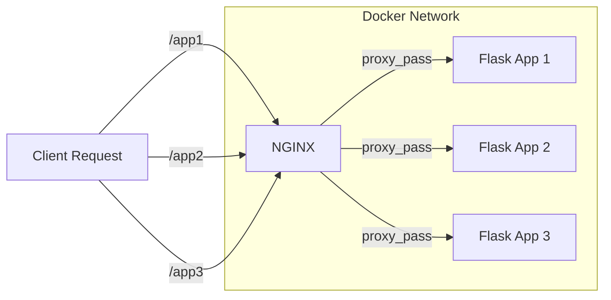

# NGINX

## Overview
NGINX is a powerful web server used as a reverse proxy to manage requests across multiple services. This note explains how to configure NGINX for Flask applications running in Docker.

---

## Key Concepts

| **Feature**       | **Description**                                                                |
| ----------------- | ------------------------------------------------------------------------------ |
| **Reverse Proxy** | Routes client requests to specific backend services (e.g., Flask containers).  |
| **Upstream**      | Defines a group of backend servers (containers) for load balancing or routing. |
| **Proxy Pass**    | Specifies where the client requests should be forwarded.                       |
| **Headers**       | Preserves client information during request forwarding.                        |

---

> [!tip] Best Practice
> Always use a **dedicated network** for containers when setting up reverse proxy routing with Docker to leverage container name resolution.

---

## Example NGINX Configuration

```nginx
worker_processes 1;

events {
    worker_connections 1024;
}

http {
    upstream app1 {
        server app1:5000;
    }
    upstream app2 {
        server app2:5000;
    }
    upstream app3 {
        server app3:5000;
    }

    server {
        listen 80;

        location /app1 {
            proxy_pass http://app1/;
            proxy_set_header Host $host;
            proxy_set_header X-Real-IP $remote_addr;
            proxy_set_header X-Forwarded-For $proxy_add_x_forwarded_for;
        }

        location /app2 {
            proxy_pass http://app2/;
            proxy_set_header Host $host;
            proxy_set_header X-Real-IP $remote_addr;
            proxy_set_header X-Forwarded-For $proxy_add_x_forwarded_for;
        }

        location /app3 {
            proxy_pass http://app3/;
            proxy_set_header Host $host;
            proxy_set_header X-Real-IP $remote_addr;
            proxy_set_header X-Forwarded-For $proxy_add_x_forwarded_for;
        }
    }
}
```

> [!note]
> This configuration assumes:
> - Flask containers are named `app1`, `app2`, `app3`.
> - All containers run on **port 5000** within the same Docker network.

---

## How It Works



---

## Steps to Implement

> [!example] Step-by-Step Implementation

### 1. Create a Docker Network
```bash
docker network create -d bridge task4-network
```

### 2. Run Flask Containers
```bash
docker run -d --name app1 --network task4-network flask-app:latest
docker run -d --name app2 --network task4-network flask-app:latest
docker run -d --name app3 --network task4-network flask-app:latest
```

### 3. Start NGINX Container
```bash
docker run -d --name nginx-proxy --network task4-network -p 80:80 -v $(pwd)/nginx.conf:/etc/nginx/nginx.conf:ro nginx:alpine
```

---

> [!warning]
> If NGINX fails to resolve the container names (`app1`, `app2`, etc.), ensure that all containers are in the **same network** (`task4-network`) and started properly.

---

## Access URLs

- **`http://localhost/app1`** → Flask App 1
- **`http://localhost/app2`** → Flask App 2
- **`http://localhost/app3`** → Flask App 3

---

## Enhancements

| **Feature**            | **Description**                                                                             |
|-------------------------|---------------------------------------------------------------------------------------------|
| **SSL/TLS**            | Use `certbot` or self-signed certificates to secure communication between NGINX and clients. |
| **Load Balancing**      | Add multiple backend servers under the same `upstream` for redundancy and scalability.      |
| **Rate Limiting**       | Configure rate limiting to protect against abuse or DoS attacks.                            |

---

## Tags
#NGINX #Docker #Flask #ReverseProxy #Networking #DevOps