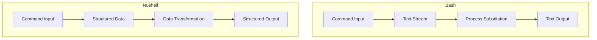

### adding path
```nu 
$env.PATH = ($env.PATH | split row (char esep) | prepend '/home/sugan/.tmuxifier/bin/')
```
- Need to append to already existing path in `env.nu` file from config dir

# Bash to Nushell Command Reference Guide

## Command Translations

| Feature                    | Bash                                          | Nushell (`nu`)                                                 | Notes                                                     |
| -------------------------- | --------------------------------------------- | -------------------------------------------------------------- | --------------------------------------------------------- |
| **Nested Commands**        | `aws s3 ls $(pulumi stack output bucketName)` | `aws s3 ls (pulumi stack output bucketName)`                   | Use `()` for command substitution in `nu`.                |
| **Variable Assignment**    | `BUCKET=$(pulumi stack output bucketName)`    | `let bucket = (pulumi stack output bucketName)`                | Use `let` for variable assignments in `nu`.               |
| **Pipeline**               | `cat file.txt \| grep "searchTerm" \| sort`   | `open file.txt \| where $it =~ "searchTerm" \| sort-by column` | `nu` uses `\|` for pipelines but with different commands. |
| **Multi-line Command**     | See code below                                | See code below                                                 | `nu` uses `{}` for multi-line blocks.                     |
| **Conditional Statements** | See code below                                | See code below                                                 | `nu` has `if`-`else` with blocks defined by `{}`.         |
| **Function Definition**    | See code below                                | See code below                                                 | `nu` uses `def` to define functions.                      |
| **Command Substitution**   | `current_dir=$(pwd)`                          | `let current_dir = (pwd)`                                      | Similar to variable assignment.                           |
| **String Interpolation**   | `echo "Hello, $USER"`                         | `echo $"Hello, $USER"`                                         | Use `$"..."` for string interpolation in `nu`.            |
| **Reading User Input**     | `read -p "Enter name: " name`                 | `let name = (input "Enter name: ")`                            | `nu` uses `input` for user input.                         |
| **Redirection**            | `echo "Hello" > file.txt`                     | `echo "Hello" \| save file.txt`                                | `nu` prefers pipelines for file operations.               |
| **Appending to File**      | `echo "Hello" >> file.txt`                    | `echo "Hello" \| save --append file.txt`                       | Use `--append` flag in `nu`.                              |
| **Chaining Commands**      | `cd /path && ls -la`                          | `cd /path; ls -la`                                             | Use `;` to chain commands in `nu`.                        |
| **Environment Variables**  | `export PATH=$PATH:/new/path`                 | `let-env PATH = ($env.PATH + ":/new/path")`                    | Use `let-env` for environment variables.                  |
| **Looping with Index**     | See code below                                | See code below                                                 | `nu` has built-in range syntax.                           |
| **Pattern Matching**       | See code below                                | See code below                                                 | Use `match` for pattern matching.                         |

### Multi-line Command

**Bash:**

```bash
for file in *.txt; do
  echo "Processing $file"
  cat "$file"
done
```

**Nushell (`nu`):**

```nu
for file in (ls *.txt) {
    echo $"Processing $file"
    open $file
}
```

---

### Conditional Statements

**Bash:**

```bash
if [ -f "file.txt" ]; then
  echo "File exists"
else
  echo "File does not exist"
fi
```

**Nushell (`nu`):**

```nu
if (test -f "file.txt") {
    echo "File exists"
} else {
    echo "File does not exist"
}
```

---

### Function Definition

**Bash:**

```bash
my_func() {
  echo "Hello, $1"
}
```

**Nushell (`nu`):**

```nu
def my_func [name] {
    echo $"Hello, $name"
}
```

---

### Looping with Index

**Bash:**

```bash
for i in {1..5}; do
  echo "$i"
done
```

**Nushell (`nu`):**

```nu
for i in 1..5 {
    echo $i
}
```

---

### Pattern Matching

**Bash:**

```bash
case $var in
  "a") echo "A";;
  *) echo "Other";;
esac
```

**Nushell (`nu`):**

```nu
match $var {
    "a" => echo "A",
    _   => echo "Other",
}
```

---

## Command Flow Diagram



## Key Differences

1. **Data Handling**
    
    - **Bash:** Works primarily with text streams.
    - **Nushell:** Uses structured data (tables and records).
2. **Command Substitution**
    
    - **Bash:** Uses `$()` or backticks `` ` ` ``.
    - **Nushell:** Uses parentheses `()`.
3. **Error Handling**
    
    - **Nushell:** Provides more robust error handling with built-in type checking and data validation.
4. **Pipeline Operations**
    
    - **Bash:** Pipelines pass text output between commands.
    - **Nushell:** Pipelines maintain data structure, allowing more powerful data transformation capabilities.


### Environments


# Environment Variable Management in Nushell

In Nushell, environment variables are managed using the `$env` variable, which functions as a record containing key-value pairs. This approach is more structured compared to traditional shells like Bash.

---

## Setting Environment Variables

To set an environment variable in Nushell, use the following syntax:

```nu
$env.VARIABLE_NAME = 'value'
```

## Accessing Environment Variables

Retrieve the value of an environment variable like so:

```nu
$env.VARIABLE_NAME
```
## Listing Environment Variables

To view all environment variables in a table format, you can use:

```nu
$env | table -e
```

This command pipes the `$env` record into the `table` command with the `-e` flag, which formats the environment variables into a structured table.

---

## Comparison with Other Shells

| Feature                        | Nushell Syntax                     | Traditional Shell (e.g., Bash) Syntax       |
|--------------------------------|------------------------------------|--------------------------------------------|
| **Setting Variables**          | `$env.VARIABLE_NAME = 'value'`     | `export VARIABLE_NAME='value'`             |
| **Accessing Variables**        | `$env.VARIABLE_NAME`               | `$VARIABLE_NAME`                           |
| **Listing Variables**          | `$env | table -e`                  | `printenv` or `env`                        |

---

## Advantages of Nushell's Approach

| Advantage                   | Description                                                                 |
|-----------------------------|-----------------------------------------------------------------------------|
| **Consistency**             | Environment variables are managed through the `$env` record, promoting a structured syntax. |
| **Readability**             | `$env` provides clear access and separation from regular variables.        |
| **Enhanced Table View**     | Using `$env | table -e` offers a neatly formatted table for all variables. |

---

Nushell encapsulates environment variables within the `$env` record, providing a more structured and consistent approach to environment management. This differs from traditional shells, where variables are accessed and managed directly, often without clear separation from other shell variables.
